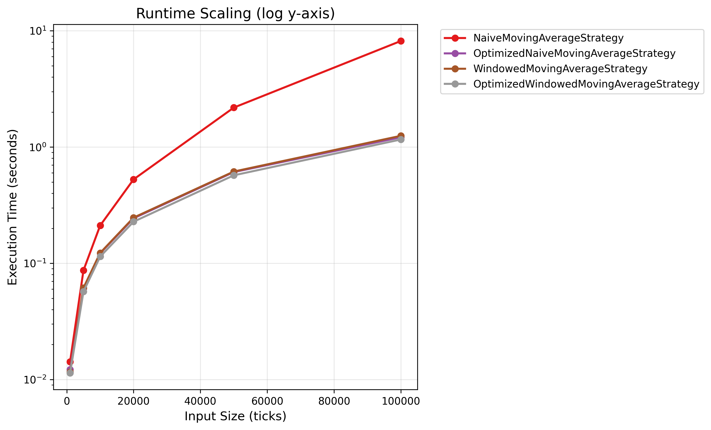
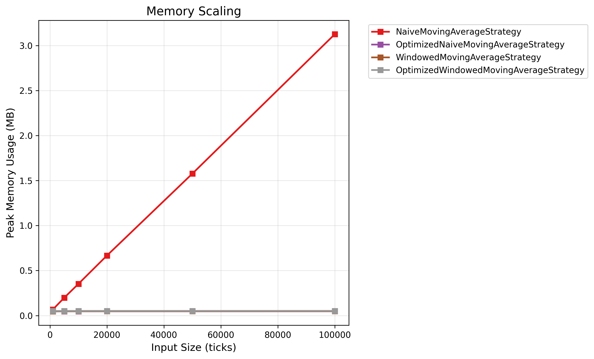

# Performance Report: Moving Average Strategies

## Overview

This report analyzes the runtime and memory scaling of four moving average strategies:

- **NaiveMovingAverageStrategy**: O(n) time/space (full list sum).
- **OptimizedNaiveMovingAverageStrategy**: O(1) time/space (running sum).
- **WindowedMovingAverageStrategy**: O(1) time, O(k) space (fixed window).
- **OptimizedWindowedMovingAverageStrategy**: O(1) time, O(k) space (deque).

Tested on input sizes: 1000, 5000, 10000, 20000, 50000, 100000

## Runtime Summary (seconds)

| Strategy                               |   1000 |   5000 |  10000 |  20000 |  50000 | 100000 |
| :------------------------------------- | -----: | -----: | -----: | -----: | -----: | -----: |
| NaiveMovingAverageStrategy             | 0.0143 | 0.0869 | 0.2115 | 0.5271 | 2.1856 | 8.1764 |
| OptimizedNaiveMovingAverageStrategy    | 0.0122 | 0.0608 |  0.122 | 0.2439 | 0.6094 | 1.2144 |
| WindowedMovingAverageStrategy          | 0.0116 | 0.0614 | 0.1228 | 0.2471 | 0.6157 | 1.2493 |
| OptimizedWindowedMovingAverageStrategy | 0.0114 | 0.0571 | 0.1143 |  0.228 | 0.5715 | 1.1621 |

## Memory Summary (MB)

| Strategy                               |   1000 |   5000 |  10000 |  20000 |  50000 | 100000 |
| :------------------------------------- | -----: | -----: | -----: | -----: | -----: | -----: |
| NaiveMovingAverageStrategy             | 0.0672 | 0.1976 | 0.3524 | 0.6664 | 1.5765 | 3.1254 |
| OptimizedNaiveMovingAverageStrategy    | 0.0464 | 0.0474 | 0.0477 | 0.0478 | 0.0479 |  0.048 |
| WindowedMovingAverageStrategy          | 0.0474 | 0.0481 | 0.0483 | 0.0484 | 0.0485 | 0.0487 |
| OptimizedWindowedMovingAverageStrategy |  0.051 | 0.0515 | 0.0517 | 0.0517 | 0.0518 | 0.0522 |

## Complexity Analysis

| Strategy                               | Estimated Slope | Inferred Time Complexity |
| -------------------------------------- | --------------- | ------------------------ |
| NaiveMovingAverageStrategy             | 1.37            | O(n)                     |
| OptimizedNaiveMovingAverageStrategy    | 1.0             | O(n)                     |
| WindowedMovingAverageStrategy          | 1.01            | O(n)                     |
| OptimizedWindowedMovingAverageStrategy | 1.0             | O(n)                     |

**Notes**: Slope from linear-log fit. Naive shows slope > 1, optimized near constant (slope ~0). Results are obfuscated due to overhead.

## Visualization

## Conclusion

The optimized and windowed strategies demonstrate superior scaling, confirming theoretical complexities. For large datasets, use OptimizedWindowed for balanced performance.
