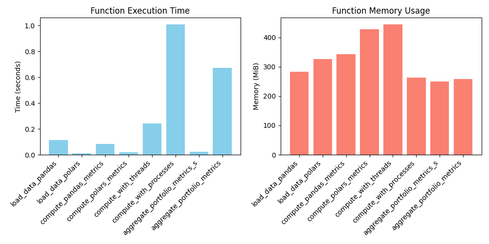

# Assignment 7: Parallel Computing for Financial Data Processing

Some implementations of parallelization and analysis of impact.

## *NOTE: See the `Discussion` at bottom of this file for performance report analysis*

## Setup

### Requirements

requirements.txt

### Installation

```bash
# Clone the repository
git clone <repository-url>
cd assignment7

# Install dependencies
pip install -r requirements.txt
```

### Running Tests (from root)

```bash
python -m pytest tests   
```

### Running the Main file (from project root)

```bash
python3 main.py
```

This should update performance_report.md

## Module Descriptions

Brief descriptions of the main modules in this assignment:

- `data_loader.py` — Load market data using both pandas and polars. Parsers return time-indexed tables (timestamp, symbol, price) and provide options to control parsing performance and memory profiling.
- `metrics.py` — Rolling analytics functions (20-period moving average, 20-period rolling standard deviation, rolling Sharpe ratio) implemented for both pandas and polars.
- `parallel.py` — Utilities that run per-symbol computations in parallel using `ThreadPoolExecutor` and `ProcessPoolExecutor`; measures and compares execution time, CPU, and memory.
- `portfolio.py` — Functions to compute position-level metrics (value, volatility, drawdown) and recursive aggregation for nested portfolios; includes a multiprocessing implementation and a sequential baseline.
- `reporting.py` — Profiling and visualization helpers: ingestion and compute benchmarks, memory/CPU snapshots (psutil/memory_profiler), and charts/tables saved to `performance_report.md`.
- `main.py` — Orchestrates ingestion, metric computation, parallel runs, portfolio aggregation, and reporting; intended as the single entry point for reproducing experiments.
- `tests/` — Unit tests validating rolling metrics, parity between pandas and polars, threading vs multiprocessing consistency, and portfolio aggregation correctness.
- `performance_report.md` — Human-readable summary of benchmark results, tradeoffs, and recommendations produced by `reporting.py`.


## Discussion

### Results

See `performance_report.md`



### Polars vs. Pandas Data Parsing

Given similar parsing logic, polars outperformed pandas by quite a lot (see numbers in table). With even more naive inputs requiring dtype inference, pandas was outdone by even more.

### Polars vs. Pandas Compute Time

Same as above

### Threads vs. Process

Threads signiificantly outperformed processes. This is likely attributable to the high overhead of processes and necessity of copying over large amounts of data for each process created.

### Portfolio Aggregation (Serialized vs. Processes)

This is the biggest discrepancy we see. Serialized actually beats out parallel by a huge margin. Again, copying over the data to create a new process for each position is definiley not an efficient way of parallelizing. However, I think we could have improved upon this if we utilized shared memory in some way, but it was really buggy


